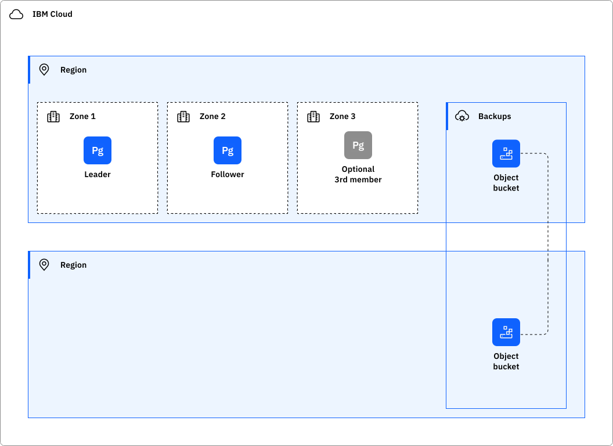
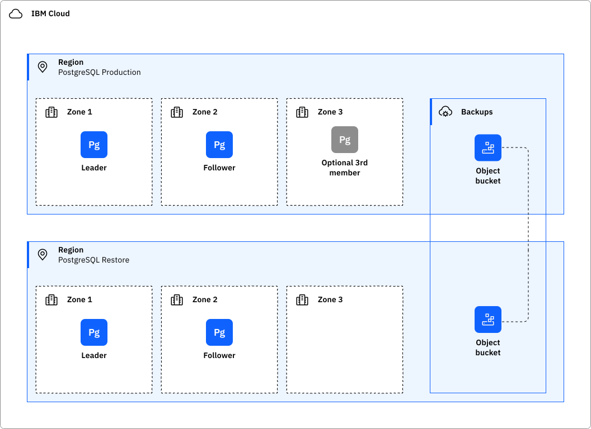

---
copyright:

  years: 2026
lastupdated: "2026-01-20"

keywords: HA, DR, high availability, disaster recovery, disaster recovery plan, disaster event, postgresql

subcollection: databases-for-postgresql

---

{{site.data.keyword.attribute-definition-list}}

# Understanding high availability and disaster recovery for {{site.data.keyword.databases-for-postgresql}}
{: #postgresql-ha-dr}

[High availability](#x2284708){: term} (HA) is the ability for a service to remain operational and accessible in the presence of unexpected failures. [Disaster recovery](#x2113280){: term} is the process of recovering the service instance to a working state.
{: shortdesc}

{{site.data.keyword.databases-for-postgresql}} is a regional service that fulfills the defined [Service Level Objectives (SLO)](/docs/resiliency?topic=resiliency-slo) with the Standard plan. For more information, see [Service Level Agreement (SLA)](https://www.ibm.com/support/customer/csol/terms/?id=i126-9268&lc=en). For more information about the available {{site.data.keyword.cloud_notm}} regions and data centers for site.data.keyword.databases-for-postgresql, see [Service and infrastructure availability by location](/docs/overview?topic=overview-services_region).

## High availability architecture
{: #ha-architecture}

{: caption="PostgreSQL high availability architecture" caption-side="bottom"}

{{site.data.keyword.databases-for-postgresql}} provides replication, failover, and high-availability features to protect your databases and data from infrastructure maintenance, upgrades, and some failures. Deployments contain a cluster with two data members - leader and replica. The replica is kept up to date using asynchronous replication. A distributed consensus mechanism is used to maintain cluster state and handle failovers. If the leader becomes unreachable, the cluster initiates a failover, and the replica is promoted to leader, and a new replica rejoins the cluster as a replica. The leader and replica will always be in different zones of an MZR. If the replica fails, a new replica is created. If a zone failure results in a member failing, the new replica will be created in a surviving zone.

You can extend high-availability further by adding [PostgreSQL members](/docs/databases-for-postgresql?topic=databases-for-postgresql-horizontal-scaling) to the cluster for greater in-region redundancy, or by provisioning [read-only replicas](/docs/databases-for-postgresql?topic=databases-for-postgresql-read-only-replicas) for cross-regional failover or read offloading.

Review the PostgreSQL documentation on [replication techniques](https://www.postgresql.org/docs/current/wal-async-commit.html){: .external} to understand the constraints and tradeoffs that are associated with the asynchronous replication strategy that is deployed by default.

In scenarios where a database becomes critically unhealthy, such as a server crash on the leader, {{site.data.keyword.databases-for-postgresql}} attempts a failover. This auto-failover capability is capped at 16 MB of data lag from leader to replica (a few rows of data once accounting for more PostgreSQL data overhead) and is not performed if the lag threshold is exceeded. If the potential for 16 MB of data loss is intolerable for the application, see [synchronous replication](#postgresql-sync-repl).

Workloads that programmatically access the cluster must follow the client availability retry logic to maintain availability.

The service will, at times, do controlled failovers under normal operation. These failovers are no-data-loss events but result in resets of active connections. There is a period of up to 15 seconds where reconnections can fail. At times, unplanned failovers might occur due to unforeseen events in the operating environment. These can take up to 45 seconds, but generally less than 30. Service maintenance, for example, triggers a controlled failover.

### High availability features
{: #ha-features}

{{site.data.keyword.databases-for-postgresql}} supports the following high availability features:

| Feature | Description | Consideration |
| -------------- | -------------- | -------------- |
| Automatic failover | Standard on all clusters and resilient against a zone or single member failure |
| Member count | Minimum - 2 members. Default is a Standard two member deployment. A two-member cluster will automatically recover from a single instance or zone failure (with data loss up to the lag threshold). During data synchronization for a new replica, the cluster has exposure to second failure causing data loss. A three-member, see [adding PostgreSQL members](/docs/databases-for-postgresql?topic=databases-for-postgresql-horizontal-scaling), is resilient to the failure of two members during the same failure period | Three members required for synchronous replication |
| Synchronous replication | Improves RPO by adding remote member sync to the data write path. Refer to [Synchronous replication](#postgresql-sync-repl}) below. | Performance impact and cost. |
| Read-only replica | Read-only replicas can provide local access in remote regions, improving availability to potential network latency or connectivity issues. | All Write requests must be directed exclusively to the read-write cluster associated with the read-replica |
{: caption="High availability features" caption-side="top"}

#### Synchronous replication {{site.data.keyword.databases-for-postgresql}}
{: #ha-synchronous-replication}

By default, streaming replication is asynchronous. If the leader crashes, some transactions that were committed might not have synced to the replica, causing data loss. {{site.data.keyword.databases-for}} ensures that data loss is kept to a minimum substantial data loss; however, synchronous replication offers the ability to confirm that all changes made by a transaction have been synced to a replica. This ensures consistency across a cluster. This consistency comes from confirming that writes are written to a secondary before returning to the connecting client with `success`. For variables regarding synchronous replication, see [`synchronous_commit`](/docs/databases-for-postgresql?topic=databases-for-postgresql-changing-configuration#gen-settings) on the Changing Configuration page.

Synchronous replication brings replica availability into the primary write path. If there is no replica to acknowledge a write, it will hang until a replica is available. This requires at least three members to function reliably, as synchronous replication is not supported on two-member deployments. You _must_ horizontally scale to at least three members before enabling synchronous replication. See [adding PostgreSQL members](/docs/databases-for-postgresql?topic=databases-for-postgresql-horizontal-scaling).

While unlikely, it is possible that more than one replica might become unavailable simultaneously. If this happens, the primary database will not be able to complete any writes until a replica comes back online, effectively blocking all write traffic to your database. When you decide to use synchronous replication, weigh the relative costs and benefits of higher data durability versus potential availability issues.

Configuring synchronous replication can significantly increase write latency and reduce overall throughput. For optimal performance, it is recommended to use synchronous replication only on specific databases or workloads that require the highest degree of data durability.
{: .note}

## Disaster recovery architecture
{: #disaster-recovery-intro}

The general strategy for disaster recovery is to create a new database, like the `Restore` database below. The contents of the new database can be a backup of the source database created before the disaster. A new database can be created using the point-in-time feature if the production database is available.

{: caption="PostgreSQL disaster recovery architecture" caption-side="bottom"}

### Disaster recovery features
{: #dr-features}

{{site.data.keyword.databases-for-postgresql}} supports the following disaster recovery features:

| Feature | Description | Consideration |
| -------------- | -------------- | -------------- |
| Backup restore | Create database from previously created backup; see [Managing Cloud Databases backups](/docs/cloud-databases?topic=cloud-databases-dashboard-backups). | New connection strings for the restored database must be referenced throughout the workload. |
| Point-in-time restore | Create database from the live production using [point-in-time recovery](/docs/databases-for-postgresql?topic=databases-for-postgresql-pitr) | This is only possible if the active database is available and the RPO (disaster) falls within the supported window. It is not useful if the production cluster is unavailable. New connection strings for the restored database must be referenced throughout the workload.  |
| Promote read replica | Create a [read-only replicas](/docs/databases-for-postgresql?topic=databases-for-postgresql-read-only-replicas) when planning for a disaster in the same or remote region. [Promote the read-only replica](/docs/databases-for-postgresql?topic=databases-for-postgresql-read-only-replicas&interface=ui#promoting-read-only-replica) to recover from a disaster. | Previously created read replica must be available. New connection strings for the restored database must be referenced throughout the workload.  |
{: caption="Disaster recovery features" caption-side="top"}

### Planning for disaster recovery
{: #features-for-disaster-recovery}

The disaster recovery steps must be practiced regularly. As you build your plan, consider the following failure scenarios and resolutions.

| Failure | Resolution |
| -------------- | -------------- |
| Hardware failure (single point) | IBM provides a database that is resilient from a single point of hardware failure within a zone - no configuration is required. |
| Zone failure | Automatic failover (#postgresql-high-availability). The database members are distributed between zones. Configuring three members will provide additional resiliency to multiple zone failures. \n \nSynchronous replication will reduce RPO at the expense of performance. |
| Data corruption | Backup restore. Use the restored database in production or for source data to correct the corruption in the restored database. \n \nPoint-in-time restore. Use the restored database in production or for source data to correct the corruption in the restored database. |
| Regional failure | Backup restore. Use the restored database in production. \n \nPromote read replica. Promote a read-only replica to a read/write database. Use the restored database in production |
{: caption="Failure scenarios and resolutions" caption-side="top"}

## Application-level high-availability
{: #application-level-ha}

Applications that communicate over networks and cloud services are subject to transient connection failures. You want to design your applications to retry connections when errors are caused by a temporary loss in connectivity to your deployment or to {{site.data.keyword.cloud_notm}}.

Because {{site.data.keyword.databases-for-postgresql}} is a managed service, regular updates and database maintenance occur as part of normal operations. This can occasionally cause short intervals where your database is unavailable. It can also cause the database to trigger a graceful fail-over, retry, and reconnect. It takes a short time for the database to determine which member is a replica and which is the leader, so you might also see a short connection interruption. Failovers generally take less than 30 seconds.

Your applications must be designed to handle temporary interruptions to the database, implement error handling for failed database commands, and implement retry logic to recover from a temporary interruption.

Several minutes of database unavailability or connection interruption are not expected. Open a [support case](https://cloud.ibm.com/unifiedsupport/cases/add) with details if you have periods longer than a minute with no connectivity so we can investigate.

## Connection limits
{: #connection-limits-ha}

{{site.data.keyword.databases-for-postgresql}} sets the maximum number of connections to your PostgreSQL database to **115**. 15 connections are reserved for the superuser to maintain the state and integrity of your database, and 100 connections are available for you and your applications. After reaching the connection limit, any attempts at starting a new connection result in an error. To prevent overwhelming your deployment with connections, use connection pooling or scale your deployment and increase its connection limit. See the [Managing PostgreSQL connections](/docs/databases-for-postgresql?topic=databases-for-postgresql-managing-connections) page for more information.

## Your responsibilities for HA and DR
{: #feature-responsibilities}

The following information can help you create and continuously practice your plan for HA and DR.

When restoring a database from backups or using point-in-time restore, a new database is created with new connection strings. Existing workloads and processes must be adjusted to consume the new connection strings. Promoting a read replica to a cluster will have a similar impact, although existing read-only portions of the workload will not be impacted.

A recovered database may also need the same customer-created dependencies of the disaster database - make sure these and other services exist in the recovered region:
- {{site.data.keyword.keymanagementservicefull}}
- {{site.data.keyword.hscrypto}}

Remember that deleting a database also deletes its associated backups. However, deleted databases may be recoverable within a limited timeframe. Refer to the [documentation](/docs/cloud-databases?topic=cloud-databases-faq-backups) for specific details on database recovery procedures.

It is not possible to copy backups off the {{site.data.keyword.cloud_notm}}, so consider using the database-specific tools for additional backups. It may be required to recover from malicious database deletion followed by a reclamation-delete of a database. Careful management of IAM access to databases can help reduce exposure to this problem.

The following checklist associated with each feature can help you create and practice your plan.

- Backup restore
   - Verify backups are available at the desired frequency to meet RPO requirements. [Managing Cloud Databases backups](/docs/cloud-databases?topic=cloud-databases-dashboard-backups) documents backup frequency. Consider a script using [IBM Cloud® Code Engine - Working with the Periodic timer (cron) event producer](/docs/codeengine?topic=codeengine-subscribe-cron) to create additional on-demand backups to improve RPO if the criticality and size of the database allow. However, given PostgreSQL's PITR capabilities, carefully evaluate the need for additional backups.
   - There are some restrictions on database restore regions - verify your restore goals can be achieved by reading [managing Cloud Databases backups](/docs/cloud-databases?topic=cloud-databases-dashboard-backups).
   - Verify the retention period of the backups meet your requirements.
   - Schedule test restores regularly to verify that the actual restored times meet the defined RTO. Remember that database size significantly impacts restore time. Please consider strategies to minimize restore times, such as breaking down large databases into smaller, more manageable units and purging unused data.
   - Verify the Key Protect service.
- Point-in-time restore
   - Verify the procedures covered earlier.
   - Verify desired backup is in the window.
- Promote read replica
   - Verify that a read replica exists in the recovery region.
   - Practice the promotion process - create a temporary read replica in the desired region. The temporary replica can be promoted to read/write and some testing performed with little impact to production.

To find out more about responsibility ownership between the customer and {{site.data.keyword.cloud_notm}} for using {{site.data.keyword.databases-for-postgresql}}, see [Shared responsibilities for {{site.data.keyword.databases-for}}](/docs/cloud-databases?topic=cloud-databases-responsibilities-cloud-databases).

## Stay informed: {{site.data.keyword.IBM_notm}} notifications
{: #ibm-service-notifications}

Updates affecting customer workloads are communicated through {{site.data.keyword.cloud_notm}} notifications. To stay informed about planned maintenance, announcements, and release notes related to this service,  refer to the [Monitoring notifications and status](/docs/account?topic=account-viewing-cloud-status) page. In addition, regularly review the [Version policy](/docs/cloud-databases?topic=cloud-databases-versioning-policy) page for the latest updates on End-of-Life versions and dates.

## Additional guidance
{: #ha_dr-guidance}

- [Understanding high availability for Cloud Databases](/docs/cloud-databases?topic=cloud-databases-ha-dr)
- [Understanding business continuity and disaster recovery for Cloud Databases](/docs/cloud-databases?topic=cloud-databases-bc-dr)
- [The high-availability read-only replica - Databases for PostgreSQL](/docs/databases-for-postgresql?topic=databases-for-postgresql-the-ha-read-only-replica)
- [Managing connections - Databases for PostgreSQL](/docs/databases-for-postgresql?topic=databases-for-postgresql-managing-connections)
