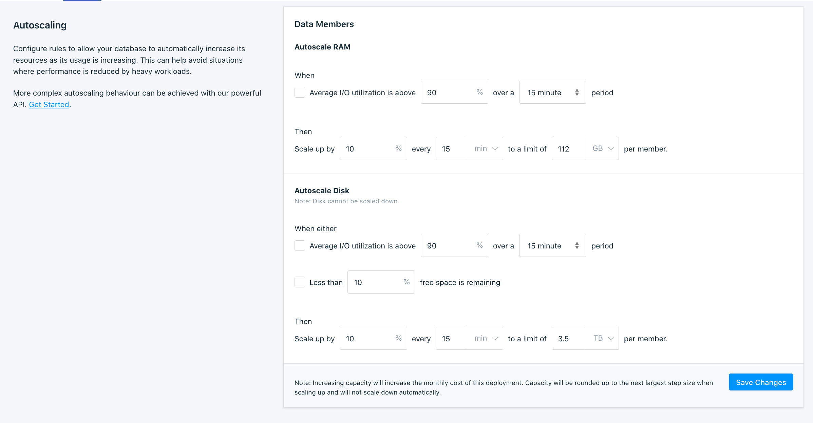

---

Copyright:
  years: 2020, 2021
lastupdated: "2021-03-30"

keywords: postgresql, databases, scaling, autoscaling, memory, disk I/O

subcollection: databases-for-postgresql

---

{:new_window: target="_blank"}
{:shortdesc: .shortdesc}
{:screen: .screen}
{:codeblock: .codeblock}
{:pre: .pre}
{:tip: .tip}


# Autoscaling
{: #autoscaling}

Autoscaling is designed to respond to the short-to-medium term trends in resource usage on your {{site.data.keyword.databases-for-postgresql_full}} deployment. When enabled, your deployment is checked at the interval you specify. If it is running short on resources, more resources are added to the deployment. To keep an eye on your resources, use the [{{site.data.keyword.monitoringfull}} integration](/docs/databases-for-postgresql?topic=databases-for-postgresql-monitoring), which provides metrics for memory, disk space, and disk I/O utilization.

You can set your deployment to autoscale disk, RAM, or both.

General Autoscaling parameters
- When to scale, based on usage over a period of time.
- By how much to scale, as a percentage of the resources per member.
- How often to scale, measured either in seconds, minutes, or hours.
- A hard limit on scaling, your deployment stops scaling at the limit.



Memory - Memory autoscaling is based on Disk I/O utilization in order to provide more memory for disk caching as your read/write load increases. The benefit is that additional memory might alleviate pressure on disk I/O by supporting more caching. Autoscaling configurations based on memory usage are currently not available. 

Disk - Disk autoscaling can scale when either disk usage reaches a certain threshold, Disk I/O utilization reach a certain threshold, or both. (The "or" in the UI operates as an `inclusive or`, `|`, `v`.) The amount of IOPS available to your deployment increases with disk size at a ratio of 10 IOPS for each GB.

The resource numbers refer to each database member in a deployment. For example, there are two data members in a PostgreSQL deployment and if the deployment is scaled with 10 GB of disk and 1 GB of RAM, that means each member gets 10 GB of disk and 1 GB of RAM. The total resources added to your deployment is 20 GB of disk and 2 GB of RAM.

## Autoscaling Considerations

- Scaling your deployment up might cause your databases to restart. If you scale RAM or CPU and your deployment needs to be moved to a host with more capacity, then the databases are restarted as part of the move.

- Disk can not be scaled down.

- A few scaling operations can be more long running than others. Drastically increasing RAM or Disk can take longer than smaller increases to account for provisioning more underlying hardware resources.

- Autoscaling operations are logged in [{{site.data.keyword.at_full}}](/docs/databases-for-postgresql?topic=cloud-databases-activity-tracker).

- Limits
  - can't set anything to scale in an interval less than 60 seconds.
  - Maximum Disk = 4 TB per member
  - Maximum RAM = 112 GB per member

- Autoscaling does not scale down deployments where disk or memory usage has shrunk. The RAM provisioned to your deployment remains for your future needs, or until you scale down your deployment manually. The disk provisioned to your deployment remains because disk can not be scaled down.

- If you just need to add resources to your deployment occasionally or rarely, you can [manually scale](/docs/databases-for-postgresql?topic=databases-for-postgresql-resources-scaling) your deployment.

- Read-only replicas do not auto-scale to match the leader. If the amount of data you store outgrows the disk that is allocated to your deployments, scale the disk on the read-only replicas and then the leader. Scaling the read-only replica first ensures that you do not run out of space on the read-only replicas. If you scaled the leader's disk for performance and not for space, it is not necessary to scale the read-only replicas.

## Configuring Autoscaling in the UI

The Autoscaling panel is on the _Resources_ tab of your deployment's _Manage_ page. To enable scaling, enter your parameters. Then, check the boxes to enable the parameters you are using. Be sure to click **Save Changes** for your configuration to be saved and your changes to take effect.

To disable autoscaling, clear the boxes for the parameters that you no longer want to use. If you clear all the boxes, autoscaling is disabled. Click **Save Changes** to save the configuration.

## Configuring Autoscaling in the CLI

You can get the autoscaling parameters for your deployment through the CLI by using the [`cdb deployment-autoscaling`](/docs/databases-cli-plugin?topic=databases-cli-plugin-cdb-reference#-ibmcloud-cdb-deployment-autoscaling-) command.
```
ibmcloud cdb deployment-autoscaling <deployment name or CRN> member
```
{: pre}

To enable and set autoscaling parameters through the CLI, use a JSON object or file with the [`cdb deployment-autoscaling-set`](/docs/databases-cli-plugin?topic=databases-cli-plugin-cdb-reference#-ibmcloud-cdb-deployment-autoscaling-set-) command.
```
ibmcloud cdb deployment-autoscaling-set <deployment name or CRN> member '{"autoscaling": { "memory": {"scalers": {"io_utilization": {"enabled": true, "over_period": "5m","above_percent": 90}},"rate": {"increase_percent": 10.0, "period_seconds": 300,"limit_mb_per_member": 125952,"units": "mb"}}}}'
```
{: pre}

## Configuring Autoscaling in the API

You can get the autoscaling parameters for your deployment through the API by sending a `GET` request to the [`/deployments/{id}/groups/{group_id}/autoscaling`](https://cloud.ibm.com/apidocs/cloud-databases-api#get-the-autoscaling-configuration-from-a-deploymen) endpoint. 
```
curl -X GET -H "Authorization: Bearer $APIKEY" 'https://api.{region}.databases.cloud.ibm.com/v4/ibm/deployments/{id}/groups/member/autoscaling'
```
{: pre}

To enable and set the autoscaling parameters for your deployment through the API, send a `POST` request to the endpoint. Enabling autoscaling works by setting the `scalers` (`io_utilization` or `capacity`) to `true`.
```
curl -X PATCH https://api.{region}.databases.cloud.ibm.com/v4/ibm/deployments/{id}/groups/member/autoscaling -H 'Authorization: Bearer <>' 
-H 'Content-Type: application/json' 
-d '{"autoscaling": {
      "memory": {
        "scalers": {
          "io_utilization": {
            "enabled": true, 
            "over_period": "5m",
            "above_percent": 90}
          },
          "limits": {
            "scale_increase_percent": 10.0,
            "scale_period_seconds": 30,
            "scale_maximum_mb": 125952,
            "units": "mb"
          }
      }
    }'
```
{: pre}

To disable autoscaling, send the PATCH request with the currently enabled scalers set to `false`. If all of them are set to `false`, then autoscaling is disabled on your deployment.
