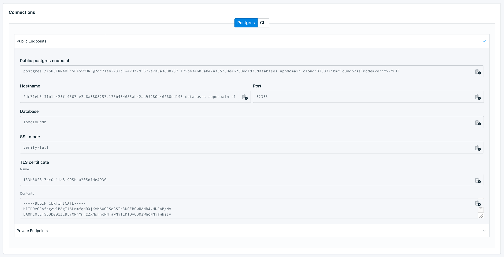

---
copyright:
  years: 2017,2019
lastupdated: "2019-04-30"

subcollection: databases-for-postgresql

---

{:new_window: target="_blank"}
{:shortdesc: .shortdesc}
{:screen: .screen}
{:codeblock: .codeblock}
{:pre: .pre}
{:tip: .tip}


# Getting Connection Strings
{: #connection-strings}

In order to connect to {{site.data.keyword.databases-for-postgresql_full}}, you need some connection strings. 

Connection Strings for your deployment are displayed on the _Dashboard Overview_, in the _Connections_ panel.



A {{site.data.keyword.databases-for-postgresql}} deployment is provisioned with an admin user, and after [setting the admin password](/docs/services/databases-for-postgresql?topic=databases-for-postgresql-admin-password), you can use it to connect to your deployment.

You are not limited to just the admin user, and connection strings can be used with any user on your deployment. See the [Creating Users](/docs/services/databases-for-postgresql?topic=databases-for-postgresql-creating-users) page for more information.

## Getting Connection Strings from the command-line

You can also grab connection strings from the [CLI](/docs/databases-cli-plugin?topic=cloud-databases-cli-cdb-reference#deployment-connections).

```
ibmcloud cdb deployment-connections example-deployment -u <username>
```
Or
```
ibmcloud cdb cxn example-deployment -u <username>
```

Full connection information is returned by the `ibmcloud cdb deployment-connections` command with the `--all` flag. To retrieve all the connection information for a deployment named  "example-deployment", use the following command.

```
ibmcloud cdb deployment-connections example-deployment -u <username> --all
```

If you don't specify a user, the `deployment-connections` commands return information for the admin user by default.
{: .tip}

## Getting Connection Strings from the API

Retrieve connection strings from the {{site.data.keyword.databases-for}} API using the `/deployments/{id}/users/{userid}/connections/{endpoint_type}` endpoint. You have to specify in the path which user and which type of endpoint (public or private) should be used in the returned connection strings.

```
curl -X GET -H "Authorization: Bearer $APIKEY" 'https://api.{region}.databases.cloud.ibm.com/v4/ibm/deployments/{id}/users/{userid}/connections/{endpoint_type}'
```

The user and endpoint type is not enforced. You can use any user on your deployment with either endpoint (if both exist on your deployment). For more information, see the [Service Endpoint Integration](/docs/services/databases-for-postgresql?topic=cloud-databases-service-endpoints) page.
{: .tip}

There are more options for customizing the contents of the returned connection strings, including an option to fill in the password field or specifying a certificate path for the self-signed certificate. See the [API Reference](https://{DomainName}/apidocs/cloud-databases-api#discover-connection-information-for-a-deployment-f-e81026) for more information.


## Connection Strings for additional users

Access to your {{site.data.keyword.databases-for-postgresql}} deployment is not just limited to the admin user. You can create additional users by using the _Service Credentials_ panel, the {{site.data.keyword.IBM_notm}} CLI, or through the {{site.data.keyword.IBM_notm}} {{site.data.keyword.databases-for}} API.

## Connection String Breakdown

### The PostgreSQL Section

The "postgres" section contains information that is suited to applications that make connections to PostgreSQL.

Field Name|Index|Description
----------|-----|-----------
`Type`||Type of connection - for PostgreSQL, it is "URI"
`Scheme`||Scheme for a URI - for PostgreSQL, it is "postgresql"
`Path`||Path for a URI - for PostgreSQL, it is the database name. The default is `ibmclouddb`.
`Authentication`|`Username`|The username that you use to connect.
`Authentication`|`Password`|A password for the user - might be shown as `$PASSWORD`
`Authentication`|`Method`|How authentication takes place; "direct" authentication is handled by the driver.
`Hosts`|`0...`|A hostname and port to connect to
`Composed`|`0...`|A URI combining Scheme, Authentication, Host, and Path
`Certificate`|`Name`|The allocated name for the self-signed certificate for database deployment
`Certificate`|Base64|A base64 encoded version of the certificate.
{: caption="Table 1. `postgresql`/`URI` connection information" caption-side="top"}

* `0...` indicates that there might be one or more of these entries in an array.

### The CLI Section

The "CLI" section contains information that is suited for connecting with `psql` .

Field Name|Index|Description
----------|-----|-----------
`Bin`||The recommended binary to create a connection; in this case it is `psql`.
`Composed`||A formatted command to establish a connection to your deployment. The command combines the `Bin` executable, `Environment` variable settings, and uses `Arguments` as command line parameters.
`Environment`||A list of key/values you set as environment variables.
`Arguments`|0...|The information that is passed as arguments to the command shown in the Bin field.
`Certificate`|Base64|A self-signed certificate that is used to confirm that an application is connecting to the appropriate server. It is base64 encoded.
`Certificate`|Name|The allocated name for the self-signed certificate.
`Type`||The type of package that uses this connection information; in this case `cli`. 
{: caption="Table 2. `psql`/`cli` connection information" caption-side="top"}

* `0...` indicates that there might be one or more of these entries in an array.

## Generating Connection Strings from the API

The _Foundation Endpoint_ that is shown on the _Overview_ panel of your service provides the base URL to access this deployment through the API. To create and manage users, use the base URL with the `/users` endpoint. Examples and documentation is available in the [API Reference](https://{DomainName}/apidocs/cloud-databases-api#creates-a-database-level-user).

To retrieve user's connection strings, use the base URL with the `/users/{userid}/connections` endpoint. Examples and documentation are also available in the [API Reference](https://{DomainName}/apidocs/cloud-databases-api#discover-connection-information-for-a-deployment-f-e81026).