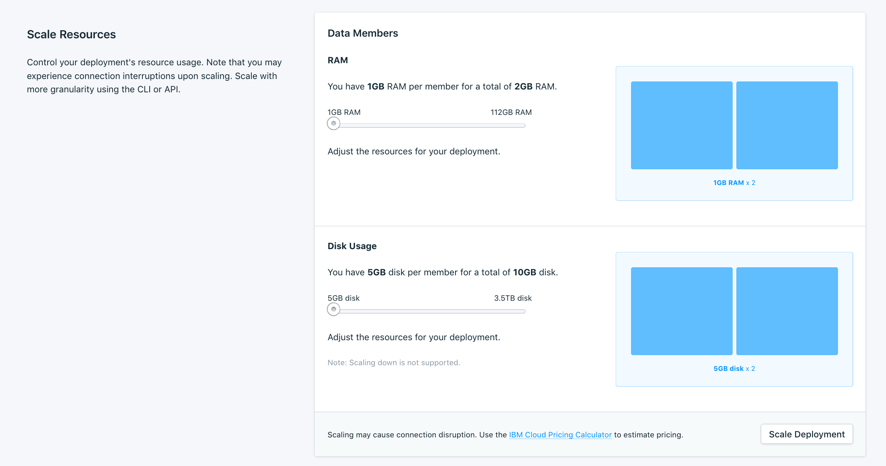

---

Copyright:
  years: 2020, 2021
lastupdated: "2021-02-04"

keywords: databases, scaling, horizontal scaling, postgresql

subcollection: databases-for-postgresql

---

{:new_window: target="_blank"}
{:shortdesc: .shortdesc}
{:screen: .screen}
{:codeblock: .codeblock}
{:pre: .pre}
{:tip: .tip}


# Adding PostgreSQL Members
{: #horizontal-scaling}

It is possible to scale your {{site.data.keyword.databases-for-postgresql_full}} deployment horizontally by adding more members. Adding members increases the reliability of deployment by spreading data across extra `Availability Zones` (where available.) It is also required horizontally scale deployments to three PostgreSQL members before enabling [synchronous replication.](https://cloud.ibm.com/docs/databases-for-postgresql?topic=databases-for-postgresql-changing-configuration#general-settings) Adding a member does not spread loads nor help with capacity in your deployment, but PostgreSQL members are eligible for failovers.

Horizontal scaling can only increase disk and memory allotments. Members cannot be scaled down. 
{: .note}

Members that you add to your deployment are added with the amount of disk, memory, and CPU as the other members currently in your deployment. A visual representation of your data members and their resource allocation is available on the _Resources_ tab of your deployment's _Manage_ page. However, horizontal scaling is only available by using the API.



{{site.data.keyword.databases-for-postgresql}} deployments have two data members in a cluster, and resources are allocated to both members equally. For example, the minimum storage of a PostgreSQL deployment is 10240 MB, which equates to an initial size of 5120 MB per member. The minimum RAM for a PostgreSQL deployment is 2048 MB, which equates to an initial allocation of 1028 MB per member.

Billing is based on the _total_ amount of resources that are allocated to the service. 
{: .tip}

## Adding Members through the API

The _Foundation Endpoint_ that is shown on the _Overview_ pane of your service provides the base URL to access this deployment through the API.

To view the current and scalable resources on a deployment, use the [/deployments/{id}/groups](https://cloud.ibm.com/apidocs/cloud-databases-api#get-currently-available-scaling-groups-from-a-depl)
```
curl -X GET -H "Authorization: Bearer $APIKEY" `https://api.{region}.databases.cloud.ibm.com/v4/ibm/deployments/{id}/groups'
```

To add members, use the [/deployments/{id}/groups/{group_id}](https://cloud.ibm.com/apidocs/cloud-databases-api#set-scaling-values-on-a-specified-group) API endpoint, sending a PATCH request with the number of members you want in your deployment. The example request increases the number of members from the default of 2 to 3.
```
curl -X PATCH 'https://api.{region}.databases.cloud.ibm.com/v4/ibm/deployments/{id}/groups/member' \
-H 'Authorization: Bearer <>' \
-H 'Content-Type: application/json' \
-d '{"members": {"allocation_count": 3}}' \
```

