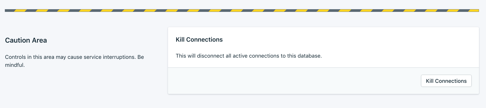

---

Copyright:
  years: 2019
lastupdated: "2019-04-25"

keywords: postgresql, databases

subcollection: databases-for-postgresql

---

{:new_window: target="_blank"}
{:shortdesc: .shortdesc}
{:screen: .screen}
{:codeblock: .codeblock}
{:pre: .pre}


# Managing PostgreSQL Connections
{: #managing-connections}

Connections to your {{site.data.keyword.databases-for-postgresql_full}} deployment use resources, so it is important to consider how many connections you need when tuning your deployment's performance. PostgreSQL uses a `max_connections` setting to limit the number of connections (and resources that are consumed by connections) to prevent run-away connection behavior from overwhelming your deployment's resources.

You can check the value of `max_connections` with your [admin user](/docs/services/databases-for-postgresql?topic=databases-for-postgresql-user-management#the-admin-user) and [`psql`](/docs/services/databases-for-postgresql?topic=databases-for-postgresql-connecting-psql).
```
ibmclouddb=> SHOW max_connections;
 max_connections
-----------------
 115
(1 row)
```

Many of the queries rely on the admin user's role as `pg_monitor`, which is only available in PostgreSQL 10 and above. Users on PostgreSQL 9.x, might not have permissions to run all of the queries in these docs.
{: .tip}

## PostgreSQL Connection Limits 

At provision, {{site.data.keyword.databases-for-postgresql}} sets the maximum number of connections to your PostgreSQL database to **115**. 15 connections are reserved for the superuser to maintain the state and integrity of your database, and 100 connections are available for you and your applications. If the number of connections to the database exceeds the 100 connection limit, new connections fail and return an error.
```
FATAL: remaining connection slots are reserved for
non-replication superuser connections
```
Exceeding the connection limit for your deployment can cause your database to be unreachable by your applications.

You can check the number of connections to your deployment with the admin user, `psql`, and `pg_stat_database`.
```sql
SELECT count(distinct(numbackends)) FROM pg_stat_database;
```

If you need to figure out where the connections are going, you can break down the connections by database.
```sql
SELECT datname, numbackends FROM pg_stat_database;
```

To further investigate connections to a specific database, query `pg_stat_activity`.
```sql
SELECT * FROM pg_stat_activity WHERE datname='ibmclouddb';
```

## Terminating Connections

If you find connections that need to be reset or closed, the admin user can use
```
SELECT public.pg_kill_connection(<pid>);
```
to stop the entire process and close the connection. This command is an alias for [`pg_terminate_backend`](https://www.postgresql.org/docs/current/functions-admin.html#FUNCTIONS-ADMIN-SIGNAL-TABLE). You cannot use `pg_terminate_backend` directly, as it requires superuser privileges to terminate other users connections. 

The `pid` of a process is found from the `pg_stat_activity` table.

### Killing All Connections

If your deployment has reached the connection limit or you are having trouble connecting to your deployment and suspect that a high number of connections is a problem, you can kill all of the connections to your deployment. 

In the UI, on the _Settings_ tab, there is a button to kill all connections to your deployment. Use caution, as it will disrupt anything that is connected to your deployment.



You can also use the [{{site.data.keyword.databases-for}} API](https://cloud.ibm.com/apidocs/cloud-databases-api#kill-connections-to-a-postgresql-deployment) to perform the kill all connections operation.

## Connection Pooling

One way to prevent exceeding the connection limit and ensure that connections from your applications are being handled efficiently is through connection pooling.

Many PostgreSQL driver libraries have connection pooling classes and functions. You need to consult your driver's documentation to implement connection pooling that is optimal for your use case. For example, the Python driver Psycopg2 has [classes to handle connection pooling in your application](http://initd.org/psycopg/docs/pool.html). The Java PostgreSQL JDBC driver has methods for [connection pooling at both the application and application server level](https://jdbc.postgresql.org/documentation/head/datasource.html).

Alternatively, you can use a third-party tool such as [PgBouncer](https://pgbouncer.github.io/) to manage your application's connections.

## Raising the Connection Limit

PostgreSQL allocates some amount of memory on a per connection basis. It is important to consider the total amount of memory that is available to your deployment before increasing the connection limit. To raise the connection limit, first you might want to [scale your deployment](/docs/services/databases-for-postgresql?topic=databases-for-postgresql-resources-scaling) to ensure that you have enough memory to accommodate more connections.

Next, change the value of `max_connections` on your deployment. To make permanent changes to the [PostgreSQL configuration](/docs/services/databases-for-postgresql?topic=databases-for-postgresql-changing-configuration#changing-configuration), you want to use the {{site.data.keyword.databases-for}} [cli-plugin](/docs/databases-cli-plugin?topic=cloud-databases-cli-cdb-reference#deployment-configuration) or [API](https://{DomainName}/apidocs/cloud-databases-api#change-your-database-configuration) to write the changes to the configuration file for your deployment. 

For example, to raise `max_connections` to 215, it might be a good idea to scale your deployment to at least 2 GB of RAM per data member, for a total of 4 GB of RAM for your deployment. Once the scaling operation has finishes, then set the connection limit. In the CLI,
```
ibmcloud cdb deployment-groups-set example-deployment member --memory 4096

ibmcloud cdb deployment-configuration example-deployment '{"configuration":{"max_connections":215}}'
```

To make the changes through the API,
```
curl -X PATCH `https://api.{region}.databases.cloud.ibm.com/v4/ibm/deployments/{id}/groups/member' \
-H "Authorization: Bearer $APIKEY" \
-H "Content-Type: application/json" \
-d '{"memory": {
        "allocation_mb": 4096
      }
    }'

curl -X PATCH 'https://api.{region}.databases.cloud.ibm.com/v4/ibm/deployments/{id}/configuration' \
-H "Authorization: Bearer $APIKEY" \
-H "Content-Type: application/json" \
-d '{"configuration":{
        "max_connections":215
      }
    }'
```


