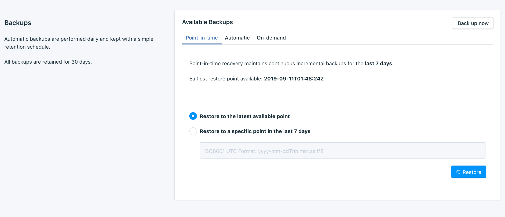
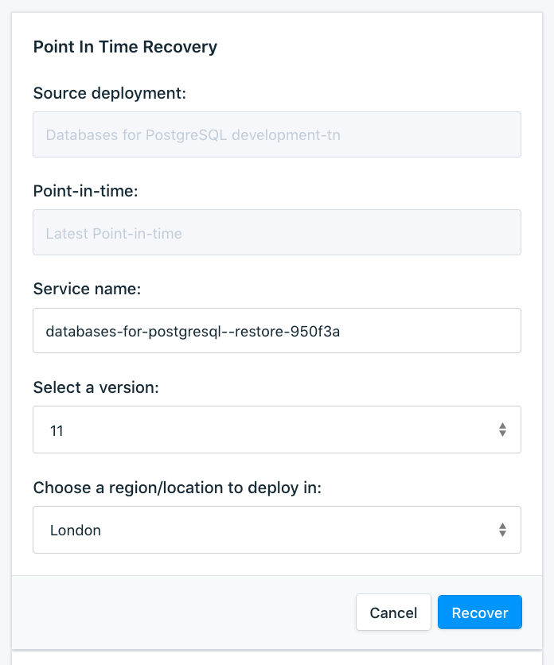

---

copyright:
  years: 2019, 2024
lastupdated: "2024-05-06"

keywords: postgresql, databases, point in time recovery, backups, restore, pitr

subcollection: databases-for-postgresql

---

{{site.data.keyword.attribute-definition-list}}

# Point-in-time Recovery
{: #pitr}

{{site.data.keyword.databases-for-postgresql_full}} offers Point-In-Time Recovery (PITR) for any time in the last 7 days. The deployment performs continuous incremental backups and can replay transactions to bring a new deployment that is restored from a backup to any point in that 7-day window you need. 

For new hosting models, PITR is currently available through the CLI, API, and Terraform.
{: note}

The _Backups_ tab of your deployment's UI keeps all your PITR information under _Point-in-Time_.

{: caption="PITR section of the Backups tab" caption-side="bottom"}

In PostgreSQL versions 13 and later, when restoring to a specific point within the last seven days, with a restore time after the last transaction, your restore fails with the message `recovery ended before configured recovery target is reached`. Before PostgreSQL v13, when restoring to a specific point within the last seven days, with a restore time after the last transaction, the latest restore point is used. If your restore fails for this reason, then `Restore to last available point` or choose an earlier date/time for `Restore to a specific point in the last 7 days`.
{: note}

Included information is the earliest time for a PITR. To discover the earliest recovery point through the CLI, use the [`cdb postgresql earliest-pitr-timestamp`](/docs/databases-cli-plugin?topic=databases-cli-plugin-cdb-reference#postgresql-earliest-pitr-timestamp) command.
```sh
ibmcloud cdb postgresql earliest-pitr-timestamp <deployment name or CRN>
```
{: pre}

To discover the earliest recovery point through the API, use the [`/deployments/{id}/point_in_time_recovery_data`](https://cloud.ibm.com/apidocs/cloud-databases-api#get-earliest-point-in-time-recovery-timestamp) endpoint to find the earliest PITR time. 
```sh
{
    "point_in_time_recovery_data": {
        "earliest_point_in_time_recovery_time": "2019-09-09T23:16:00Z"
    }
}
```
{: .codeblock}

## Recovery
{: #recovery}

Backups are restored to a new deployment. After the new deployment finishes provisioning, your data in the backup file is restored into the new deployment. Backups are also restorable across accounts, but only by using the API and only if the user that is running the restore has access to both the source and destination accounts. 

By default the new deployment is auto-sized to the same disk and memory allocation as the source deployment at the time of the backup that you are restoring from. Especially in the case of PITR that might not be the current size of your deployment. If you need to adjust the resources that are allocated to the new deployment, use the optional fields in the UI, CLI, or API to resize the new deployment. Be sure to allocate enough for your data and workload, if the deployment is not given enough resources the restore fails.

While storage and memory are restored to the same as the source deployment, specific instance configurations are not automatically set for the new instance. In this case, rerunning the configuration after a restore might be needed. Note any instance modifications before running the restore (parameters like shared_buffers, max_connections, deadlock_timeout, archive_timeout, and others) to ensure accurate setting for the instance after the restore is complete.

It is important that you do not delete the source deployment while the backup is restoring. You must wait until the new deployment is provisioned and the backup is restored before deleting the old deployment. Deleting a deployment also deletes its backups so not only does the restore fail, you might not be able to recover the backup either.
{: .tip}

### Recovery in the UI
{: #pitr-ui}
{: ui}

To initiate a PITR, enter the time that you want to restore back to in Coordinated Universal Time. If you want to restore to the most recent available time, select that option. Clicking **Restore** brings up the options for your recovery. Enter a name, select the version, region, and allocated resources for the new deployment. Click **Recover** to start the process.

{: caption="Recovery Options Dialog" caption-side="bottom"}

If you use Key Protect and have a key, you must use the CLI to recover, and a command is provided for your convenience.

### Recovery in the CLI
{: #pitr-cli}
{: cli}

The Resource Controller supports provisioning of database deployments, and provisioning and restoring are the responsibility of the Resource Controller CLI. Use the [`resource service-instance-create`](/docs/cli?topic=cli-ibmcloud_commands_resource#ibmcloud_resource_service_instance_create) command.

For PITR, use the `point_in_time_recovery_time` and `point_in_time_recovery_deployment_id` parameters. The `point_in_time_recovery_deployment_id` is the source deployment's ID and `point_in_time_recovery_time` is the timestamp in Coordinated Universal Time you want to restore to. To restore to the latest available point-in-time, use `"point_in_time_recovery_time":" "`.
```sh
ibmcloud resource service-instance-create <SERVICE_INSTANCE_NAME> <service-id> <region> -p '{"point_in_time_recovery_deployment_id":"DEPLOYMENT_ID", "point_in_time_recovery_time":"TIMESTAMP", "version":" "}'
```
{: pre}

A pre-formatted command for a specific backup or PITR is available in detailed view of the backup.
{: .tip}


When restoring through the CLI, optional parameters are available. Use them to customize resources or use a Key Protect key for BYOK encryption on the new deployment.
```sh
ibmcloud resource service-instance-create <SERVICE_INSTANCE_NAME> <service-id> standard <region> <--service-endpoints SERVICE_ENDPOINTS_TYPE> -p
'{"point_in_time_recovery_deployment_id":"DEPLOYMENT_ID", "point_in_time_recovery_time":"TIMESTAMP","key_protect_key":"KEY_PROTECT_KEY_CRN", "members_disk_allocation_mb":"DESIRED_DISK_IN_MB", "members_memory_allocation_mb":"DESIRED_MEMORY_IN_MB", "members_cpu_allocation_count":"NUMBER_OF_CORES", "version":" "}'
```
{: pre}

### Recovery in the API
{: #pitr-api}
{: api}

The Resource Controller supports provisioning of database deployments, and provisioning and restoring are the responsibility of the Resource Controller API. You need to complete [the necessary steps to use the resource controller API](/docs/databases-for-postgresql?topic=cloud-databases-provisioning#provisioning-through-the-resource-controller-api) before you can use it to restore from a backup. 

Once you have all the information, the create request is a `POST` to the [`/resource_instances`](https://{DomainName}/apidocs/resource-controller#create-provision-a-new-resource-instance) endpoint.

```sh
curl -X POST \
  https://resource-controller.cloud.ibm.com/v2/resource_instances \
  -H 'Authorization: Bearer <>' \
  -H 'Content-Type: application/json' \
    -d '{
    "name": "<SERVICE_INSTANCE_NAME>",
    "target": "<region>",
    "resource_group": "<your-resource-group>",
    "resource_plan_id": "<service-id>"
    "point_in_time_recovery_time":"<TIMESTAMP>",
    "point_in_time_recovery_deployment_id":"<DEPLOYMENT_ID>"
  }'
```
{: pre}

The parameters `name`, `target`, `resource_group`, and `resource_plan_id` are all required. The `target` is the region where you want the new deployment to be located, which can be a different region from the source deployment. Cross region restores are supported, except for restoring a `eu-de` backup to another region.

For PITR, use the `point_in_time_recovery_time` and `point_in_time_recovery_deployment_id` parameters. The `point_in_time_recovery_deployment_id` is the source deployment's ID and `point_in_time_recovery_time` is the timestamp in Coordinated Universal Time you want to restore to. To restore to the latest available point-in-time use `"point_in_time_recovery_time":" "`.

If you need to adjust resources or use a Key Protect key, add the optional parameters `key_protect_key`, `members_disk_allocation_mb`, `members_memory_allocation_mb`, and/or `members_cpu_allocation_count`, and their values to the body of the request.

## Verifying PITR
{: #pitr-verify}

To verify the correct recovery time, check the database logs. Checking the database logs requires the [Logging Integration](/docs/databases-for-postgresql?topic=databases-for-postgresql-logging) to be set up on your deployment.

When you perform a recovery, your data is restored from the most recent incremental backup. Any outstanding transactions from the WAL log are used to restore your database up to the time you recovered to. After the recovery is finished, and the transactions are run, the logs display a message. You can check that your logs have the message,
```sh
LOG:  last completed transaction was at log time 2019-09-03 19:40:48.997696+00
```

There are two scenarios where recovery does not show up in the logs. 
1. Your deployment has a recent full backup and there is no activity after the backup was taken that needs to be replayed.
2. If you entered a time to recover to that is **after** the current time or is past latest available point-in-time recovery point.

In both cases the recovery is usually still successful, but there won't be an entry in the logs to check the exact time that the database was restored to.
