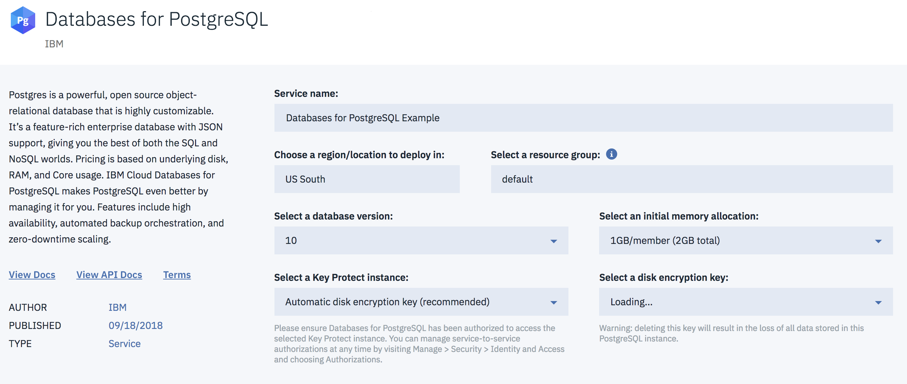

---

copyright:
  years: 2018
lastupdated: "2018-09-13"
---

{:shortdesc: .shortdesc}
{:new_window: target="_blank"}
{:codeblock: .codeblock}
{:pre: .pre}
{:screen: .screen}
{:tip: .tip}

# Provisioning {{site.data.keyword.databases-for-postgresql}}

To create an {{site.data.keyword.databases-for-postgresql_full}} deployment, you will need to create an {{site.data.keyword.cloud}} service instance. A service instance can represent different types of service. The service type is determined by the service id and you will need to specify the appropriate service id when creating a new service instance. For {{site.data.keyword.databases-for-postgresql}} the service id is `databases_for_postgresql`.


## Using the Catalog

You can create a {{site.data.keyword.databases-for-postgresql}} service from the [{{site.data.keyword.databases-for-postgresql}} page](https://console.{DomainName}/catalog/services/databases-for-postgresql/) in the {{site.data.keyword.cloud_notm}} catalog.



When creating the deployment from the catalog, users need to specify:

1. **The service name**: This can be any string and will be the name used on the web and in the command line to identify the new database deployment.
2. **The region**: This is the region in which the database deployment resides. Currently, only US-South is available.
3. **The database version**: This is the major version of the database to be created within the deployment. The latest minor version will always be used automatically. Note that PostgreSQL changed versioning strategy at version 10. Previously, a major versions was two sets of numbers (e.g. 9.6) but from version 10, the major version is a single number (e.g. 10, 11). The most recent version is always automatically selected.

Users can optionally set:

1. **The resource group**: If you are organizing your services into [resource groups](/docs/resources/bestpractice_rgs.html#bp_resourcegroups), you can specify the resource group in this field. Otherwise, you can leave it at default.
2. **Disk encryption**: Optionally, a Key Protect instance may be selected if the user has Key Protect configured. If it is configured, once the service is selected, a disk encryption key may be selected from the Key Protect service. By default, Key Protect is not used and the deployment automatically creates and manages its own disk encryption key. 

Users cannot set:

1. **The service plan**: A service may have a number of plan types with different pricing, resources or other features, each with their own service plan id. For {{site.data.keyword.databases-for-postgresql}}, there is currently one service plan, standard. 

Once the appropriate settings have been selected, click on **Create** to start the provisioning process off.

Be aware that the database will take some time to actually deploy. The user will be navigated on the web to the newly created database and shown a view if the Manage tab which will inform them when the database is ready for use.

## Using the Command Line

The {{site.data.keyword.cloud_notm}} CLI tool is what you use to communicate with {{site.data.keyword.cloud_notm}} from your terminal or command line. For more information, see [Download and install {{site.data.keyword.cloud_notm}} CLI](https://console.{DomainName}/docs/cli/reference/bluemix_cli/download_cli.html).

To create a {{site.data.keyword.databases-for-postgresql}} deployment, you use the CLI to request a service instance with a `databases-for-postgresql` service id.

The template for the command that should be used is:

```
ibmcloud resource service-instance-create <service-name> <service-id> <service-plan-id> <region>
```

More information about this command, in general, is availanble in the [CLI reference for resource groups](/docs/cli/reference/ibmcloud/cli_resource_group.html#ibmcloud_resource_service_instance_create).

In the specific case of creating a {{site.data.keyword.databases-for-postgresql}}, a user would set the service name to their chosen name, not forgetting to quote any name with spaces in it, set `databases-for-postgresql` as the service id, enter `standard` for the service plan id and `us-south` for the region.

```
ibmcloud resource service-instance-create example-psql databases-for-postgresql standard us-south
```

This would begin the process of provisioning the database deployment. Be aware that the database will take some time to actually deploy. The user can navigate on the web to the newly created database and view the Manage tab which will inform them when the database is ready for use. The user can also run:

```
ibmcloud resource service-instance <service-name>
```

This command will report the current state of the service instance.

### Additional parameters

The `service-instance-create` command supports a `-p` flag which allows addition parameters to be passed to the provisioning process. The parameters are in JSON format. Some parameters values are CRNs (Cloud Resource Name), which uniquely identifies a resource in the cloud. All parameter names and values are passed as strings.

* **backup_id**: A CRN of a backup resource to restore from. The backup must have been created by a database deployment with the same service id. The backup will be loaded and the new deployment will start up using that data. A backup CRN will be in the format `crn:v1:<...>:backup:<uuid>`. If omitted, the database will be provisioned empty. This parameter cannot be set with a **version** parameter
* **version**: The version of the database to be provisioned. This will be the major version number as found in the UI. If omitted, the database will be created with the most recent major and minor version. This parameter cannot be set with a **backup_id** parameter.
* **key_protect_key**: A CRN which references a Key Protect key which will then be used for disk encryption.
* **members_memory_allocation_mb**: Total amount of memory to be shared between the database members within the database. For example, if the value is "4096" then the two database members will get 4GB of RAM between them, giving 2GB of RAM per member. If omitted, the default value is used; "2048".

For example, if a database as being provisioned from a particular backup and the new database deployment will have two 2GB members, then the command would be:

```
ibmcloud resource service-instance-create example-psql databases-for-postgresql standard us-south \
-p \ '{
  "backup_id": "crn:v1:bluemix:public:databases-for-postgresql:us-south:a/54e8ffe85dcedf470db5b5ee6ac4a8d8:1b8f53db-fc2d-4e24-8470-f82b15c71717:backup:06392e97-df90-46d8-98e8-cb67e9e0a8e6",
  "members_memory_allocation_mb": "4096"
}'
```


## Using the API

The Resource Controller API is not currently publicly documented. We recommend using the command line to provision new database deployments in the interim.

