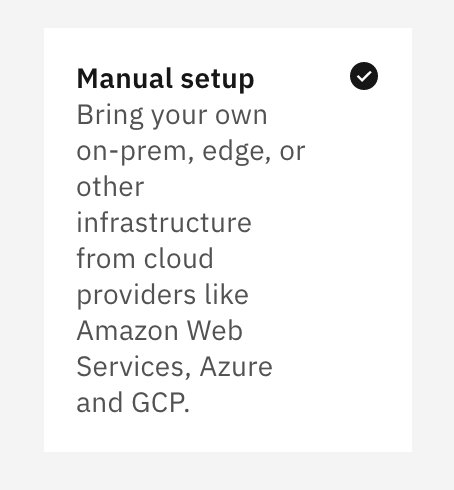
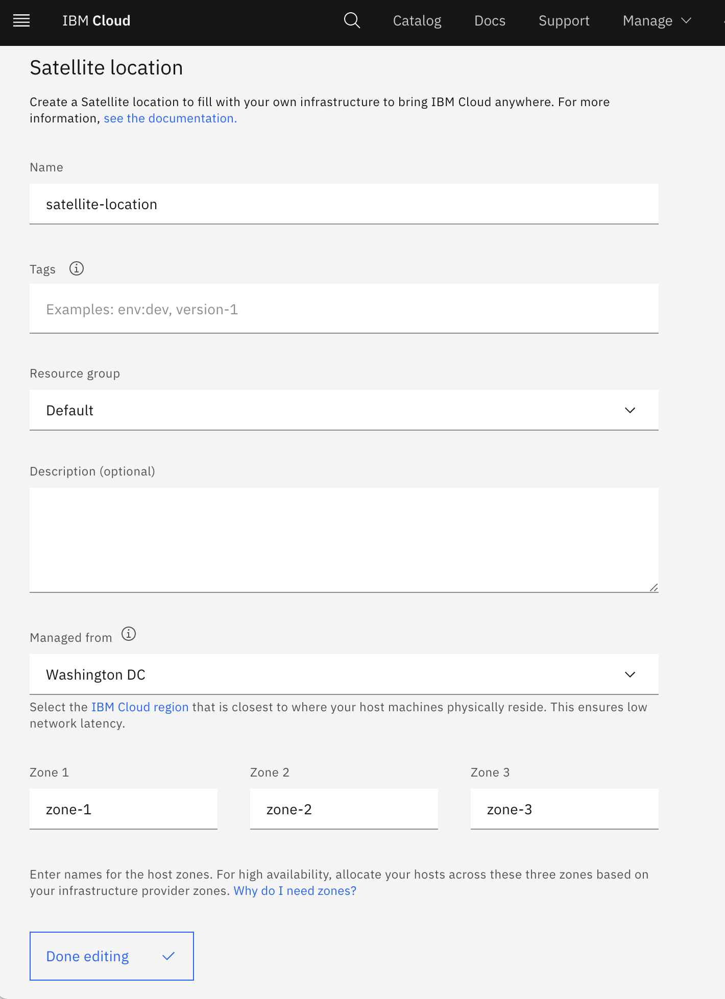
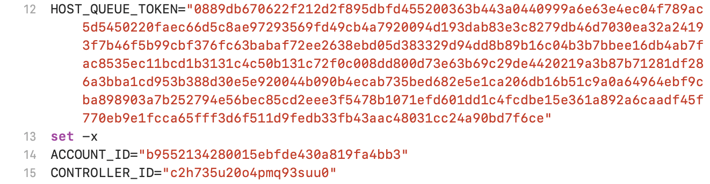

---

copyright:
  years: 2021
lastupdated: "2021-06-16"

keywords: IBM Cloud, databases, Satellite, ICD, get started

subcollection: databases-for-postgresql

content-type: tutorial
services: databases-for-postgresql
completion-time: 15m

---

{:codeblock: .codeblock}
{:screen: .screen}
{:download: .download}
{:external: target="_blank" .external}
{:faq: data-hd-content-type='faq'}
{:gif: data-image-type='gif'}
{:important: .important}
{:note: .note}
{:pre: .pre}
{:tip: .tip}
{:preview: .preview}
{:deprecated: .deprecated}
{:beta: .beta}
{:term: .term}
{:shortdesc: .shortdesc}
{:script: data-hd-video='script'}
{:support: data-reuse='support'}
{:table: .aria-labeledby="caption"}
{:troubleshoot: data-hd-content-type='troubleshoot'}
{:help: data-hd-content-type='help'}
{:tsCauses: .tsCauses}
{:tsResolve: .tsResolve}
{:tsSymptoms: .tsSymptoms}
{:java: .ph data-hd-programlang='java'}
{:javascript: .ph data-hd-programlang='javascript'}
{:swift: .ph data-hd-programlang='swift'}
{:curl: .ph data-hd-programlang='curl'}
{:video: .video}
{:step: data-tutorial-type='step'}
{:tutorial: data-hd-content-type='tutorial'}
{:ui: .ph data-hd-interface='ui'}
{:cli: .ph data-hd-interface='cli'}
{:api: .ph data-hd-interface='api'}

# Getting started with IBM Cloud Databases for PostgreSQL enabled by IBM Cloud Satellite
{: #getting-started}
{: toc-content-type="tutorial"}
{: toc-completion-time="15m"}

With IBM Cloud Databases for PostgreSQL enabled by IBM Cloud Satellite, you can choose a location to represent a data center that you fill with your own infrastructure resources and start running IBM Cloud™ Databases on your own infrastructure.
{: shortdesc}

# Objective
{: #objective}

This tutorial focuses on the steps required to set up an IBM Cloud Databases for PostgreSQL enabled by IBM Cloud Satellite service instance and location.

## Before you begin
{: #before-start}
- You need to have an [{{site.data.keyword.cloud_notm}} account](https://cloud.ibm.com/registration){:new_window}.
- You will also need a {{site.data.keyword.databases-for-postgresql}} deployment. You can provision one from the [{{site.data.keyword.cloud_notm}} catalog](https://cloud.ibm.com/catalog/services/databases-for-postgresql). Give your deployment a memorable name that appears in your account's Resource List.
- [Set the Admin Password](/docs/databases-for-postgresql?topic=databases-for-postgresql-admin-password) for your deployment.

## Setting Up a Satellite Service 
{: step}

1. Log in to your [{{site.data.keyword.cloud_notm}} account](https://cloud.ibm.com/registration){:new_window}.
1. Create a new preproduction Satellite location in a non-default resource group. For more information on setting up a satellite location, refer to [Setting up Satellite locations](https://cloud.ibm.com/docs/satellite?topic=satellite-locations) in the {{site.data.keyword.satellitelong}} documentation.
1. When creating Satellite location, choose `Manual setup`.

## Create a Satellite location
{: step}

1. Complete the form to create your Satellite location:
  - Provide a name.
  - Choose a Resource group.
  - Enter name for the host zone. 

Zones 1, 2, and 3 should retain their respective default values: zone-1, zone-2, zone-3.
{: note}

2. Click `Done editing` to complete your Satellite creation.

## Attach hosts to your location
{: step}

- Download the generated script, which contains location-specific information. 
- From the script, extract three parameters:
  - `HOST_QUEUE_TOKEN`
  - `ACCOUNT_ID`
  - `CONTROLLER_ID`

[View the full documentation for this step](https://test.cloud.ibm.com/docs/satellite?topic=satellite-getting-started#attach-hosts-to-location)

4. To attach hosts to the new location, run the terraform script with the extracted parameters.
- Satellite control plane: 3 * 8x32 hosts (AWS m5d.2xlarge)
- Per ICD dataplane cluster
  - internal nodes: 3 * 8x32 hosts (AWS m5d.2xlarge)
  - customer nodes : 3 * 32x128 hosts (AWS m5d.8xlarge), (multiples of three)
  - no edge nodes needed
  
## Configure the control plane
{: step}

- Assign 3 hosts (8x32) to the Satellite control plane and assign the zones of those worker nodes, accordingly.

These newly assigned nodes will take several minutes to appear in the Satellite UI.
{: note}

[View the full documentation for this step](https://test.cloud.ibm.com/docs/satellite?topic=satellite-getting-started#assign-hosts-to-cp)

