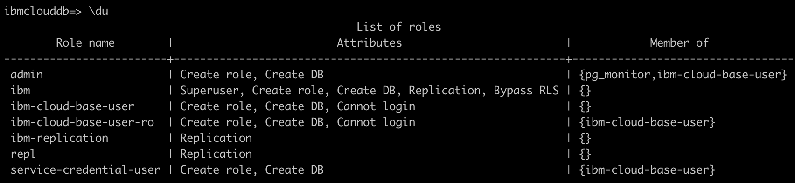

---

copyright:
  years: 2019, 2020
lastupdated: "2021-11-11"

keywords: admin, superuser, roles, service credentials

subcollection: databases-for-postgresql

---

{:shortdesc: .shortdesc}
{:external: .external target="_blank"}
{:codeblock: .codeblock}
{:pre: .pre}
{:screen: .screen}
{:tip: .tip}


# Managing Users, Roles, and Privileges 
{: #user-management}

PostgreSQL uses a system of roles to manage database permissions. Roles are used to give a single user or a group of users a set of privileges. You can determine roles, groups, and privileges for all roles across your deployment by using the `psql` command `\du`.

{: caption="Figure 1. Table Results from \du command" caption-side="bottom"}

When you provision a new deployment in {{site.data.keyword.cloud_notm}}, you are automatically given an admin user to access and manage PostgreSQL.

## The `admin` user
{: #user-admin}

When you provision a new deployment in {{site.data.keyword.cloud_notm}}, you are automatically given an admin user to access and manage PostgreSQL. Once you [set the admin password](/docs/databases-for-postgresql?topic=databases-for-postgresql-admin-password), you can use it to connect to your deployment.

When admin creates a resource in a database, like a table, admin owns that object. Resources that are created by admin are not accessible by other users, unless you expressly grant permissions to them.

The biggest difference between the admin user and any other users you add to your deployment is the [`pg_monitor`](https://www.postgresql.org/docs/current/default-roles.html) and [`pg_signal_backend`](https://www.postgresql.org/docs/current/default-roles.html) roles. The `pg_monitor` role provides a set of permissions that makes the admin user appropriate for monitoring the database server. The `pg_signal_backend` role provides the admin user the ability to send signals to cancel queries and connections initiated by other users. It does not provide the ability to send signals to processes owned by superusers.

`pg_monitor` is only available in PostgreSQL 10 and above. `pg_signal_backend` is only available in PostgreSQL 9.6 and above.
{: .tip} 

You can also use the admin user to grant these two roles to other users on your deployment.

If you want to expose the ability to cancel queries to other database users, you can grant the `pg_signal_backend` role from the admin user. For example, 
```sql
GRANT pg_signal_backend TO joe;
```
{: .codeblock}

to allow the user `joe` to cancel backends. You can also grant `pg_signal_backend` to all the users with the `ibm-cloud-base-user` role with 
```sql
GRANT pg_signal_backend TO "ibm-cloud-base-user";
``` 
{: .codeblock}

Be aware this privilege allows the user or users to terminate any connections to the database, so assign it with care.

Similarly, if you want to setup a specific monitoring user, `mary`, you can use
```shell
GRANT pg_monitor TO mary;
```
{: .codeblock}

You can also grant `pg_signal_backend` to all the users with the `ibm-cloud-base-user` role with 
```sql
GRANT pg_monitor TO "ibm-cloud-base-user";
```
{: .codeblock}

## _Service Credential_ Users
{: #user-management-service-cred}

Users that you [create through the _Service Credentials_ panel](/docs/databases-for-postgresql?topic=databases-for-postgresql-user-management#creating-users-in-_service-credentials_) are members of `ibm-cloud-base-user`. They are able to log in, create users, and create databases.

When a user in a group creates a resource in a database, like a table, all users that are in the same group have access to that resource.  Resources created by any of the users in `ibm-cloud-base-user` are accessible to other users in `ibm-cloud-base-user`, including the admin user.

## Users created through the CLI and the API
{: #user-management-cli-api}

Users that you create through the Cloud Databases API and the Cloud Databases CLI will also be members of `ibm-cloud-base-user`. They are able to log in, create users, and create databases.

When a user creates a resource in a database, like a table, all users that are in the same group have access to that resource.  Resources created by any of the users in `ibm-cloud-base-user` are accessible to other users in `ibm-cloud-base-user`, including the admin user.

Users that are created directly from the API and CLI do not appear in _Service Credentials_, but you can [add them](/docs/databases-for-postgresql?topic=databases-for-postgresql-user-management#adding-users-to-_service-credentials_) if you choose.

## The read-only user
{: #user-management-read-only-user}

The `ibm-cloud-base-user-ro` manages privileges for users that are created to access read-only replicas. More information can be found on the [Configuring Read-only Replicas](/docs/databases-for-postgresql?topic=databases-for-postgresql-read-only-replicas) page.

## The `repl` user
{: #user-management-repl-user}

The `repl` user has Replication privileges and is used if you enable the [`wal2json` plugin](/docs/databases-for-postgresql?topic=databases-for-postgresql-wal2json) on your deployment. In the process of enabling `wal2json`, you set the `repl` user's password, which allows the `wal2json` plugin to use it.

## Other `ibm` Users
{: #user-management-ibm-users}

If you run the `\du` command with your admin account, you might notice users that are named `ibm`,  `ibm-cloud-base-user`, and `ibm-replication`.

The `ibm-cloud-base-user` is used as a template to manage group roles for other users. It is used to manage the users created through the CLI and API as well as enable the integration with the _Service Credentials_ user creation on IBM Cloud. A user that is a member of `ibm-cloud-base-user` inherits the create role and create database attributes from `ibm-cloud-base-user`. The `ibm-cloud-base-user` is not able to log in.

The `ibm` and the `ibm-replication` accounts are the only superusers on your deployment. A superuser account is not available for you to use. These users are internal administrative accounts that manage replication, metrics, and other functions that ensure the stability of your deployment.

## Users created with `psql`
{: #user-management-psql}

You can bypass creating users through IBM Cloud entirely, and create users directly in PostgreSQL with `psql`. This allows you to make use of PostgreSQL's native [role and user management](https://www.postgresql.org/docs/current/database-roles.html). Users/roles created in `psql` have to have all of their privileges set manually, as well as privileges to the objects that they create.

Users that are created directly in PostgreSQL do not appear in _Service Credentials_, but you can [add them](/docs/databases-for-postgresql?topic=databases-for-postgresql-connection-strings#adding-users-to-_service-credentials_) if you choose. 

Note that these users are not integrated with IAM controls, even if added to _Service Credentials_.
{: .tip}


## Additional Users and Connection Strings
{: #creating_users}

Access to your {{site.data.keyword.databases-for-postgresql}} deployment is not limited to the admin user. You can create users by using the _Service Credentials_ panel, the {{site.data.keyword.IBM_notm}} CLI, or through the {{site.data.keyword.IBM_notm}} {{site.data.keyword.databases-for}} API. 

All users on your deployment can use the connection strings, including connection strings for either public or private endpoints.

When you create a user, it is assigned certain database roles and privileges. These privileges include the ability to login, create databases, and create other users. For more information, see the [Managing Users, Roles, and Privileges](/docs/databases-for-postgresql?topic=databases-for-postgresql-user-management) page.

### Creating Users in _Service Credentials_
{: #user-management-creating-users-service-cred}

1. Navigate to the service dashboard for your service.
2. Click _Service Credentials_ to open the _Service Credentials_ panel.
3. Click **New Credential**.
4. Choose a descriptive name for your new credential. 
5. (Optional) Specify if the new credentials should use a public or private endpoint. Use either `{ "service-endpoints": "public" }` / `{ "service-endpoints": "private" }` in the _Add Inline Configuration Parameters_ field to generate connection strings using the specified endpoint. Use of the endpoint is not enforced, it just controls which hostnames are in the connection strings. Public endpoints are generated by default.
6. Click **Add** to provision the new credentials. A username and password, and an associated database user in the PostgreSQL database are auto-generated.

The new credentials appear in the table, and the connection strings are available as JSON in a click-to-copy field under _View Credentials_.

### Creating Users from the command line
{: #user-management-creating-users-cli}

If you manage your service through the {{site.data.keyword.cloud_notm}} CLI and the [cloud databases plug-in](/docs/cli?topic=cli-install-ibmcloud-cli), you can create a new user with `cdb user-create`. For example, to create a new user for an "example-deployment", use the following command.
```shell
ibmcloud cdb user-create example-deployment <newusername> <newpassword>
```
{: pre}

Once the task has finished, you can retrieve the new user's connection strings with the `ibmcloud cdb deployment-connections` command.

### Creating Users from the API
{: #user-management-creating-users-api}

The _Foundation Endpoint_ that is shown on the _Overview_ panel _Deployment details_ of your service provides the base URL to access this deployment through the API. To create and manage users, use the base URL with the `/users` endpoint.
```curl
curl -X POST 'https://api.{region}.databases.cloud.ibm.com/v4/ibm/deployments/{id}/users' \
-H "Authorization: Bearer $APIKEY" \
-H "Content-Type: application/json" \
-d '{"username":"jane_smith", "password":"newsupersecurepassword"}'
```
{: pre}

Once the task has finished, you can retrieve the new user's connection strings, from the `/users/{userid}/connections` endpoint.

### Adding users to _Service Credentials_
{: #user-management-adding-users-service-cred}

Creating a new user from the CLI doesn't automatically populate that user's connection strings into _Service Credentials_. If you want to add them there, you can create a new credential with the existing user information.

Enter the user name and password in the JSON field _Add Inline Configuration Parameters_, or specify a file where the JSON information is stored. For example, putting `{"existing_credentials":{"username":"Robert","password":"supersecure"}}` in the field generates _Service Credentials_ with the username "Robert" and password "supersecure" filled into connection strings.

Generating credentials from an existing user does not check for or create that user.
{: tip}

