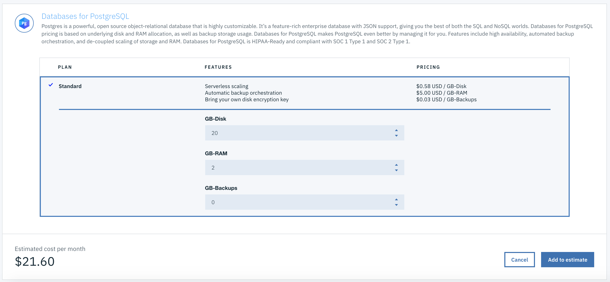

---
copyright:
  years: 2017,2020
lastupdated: "2021-10-20"

keywords: postgresql, databases, pricing, resources, scaling

subcollection: databases-for-postgresql

---

{:new_window: target="_blank"}
{:shortdesc: .shortdesc}
{:screen: .screen}
{:codeblock: .codeblock}
{:pre: .pre}
{:tip: .tip}

# Pricing
{: #pricing}

A {{site.data.keyword.databases-for-postgresql}} Standard plan deploys as one highly available PostgreSQL cluster with two data members, with your data replicated on both members. The Standard plan is priced based on the total amount of disk storage, RAM, dedicated cores, and backup storage that is allocated to deployments, prorated hourly. {{site.data.keyword.databases-for-postgresql}} deployments have a minimum of 5 GB of disk and 1 GB of RAM per data member.

Templates are provided for ease of use and provide balanced resource allocations appropriate for general purpose workloads. The **Custom** tab can be used to configure Disk, RAM, and vCPU, as desired.

## Cost Breakdown

**Disk storage per data member** - gigabytes of disk that are allocated to a {{site.data.keyword.databases-for-postgresql}} data member, or the size of your data.  
**RAM per data member** - gigabytes of RAM that are allocated to a {{site.data.keyword.databases-for-postgresql}} data member.  
**Backup storage** - amount of storage used for backups by a {{site.data.keyword.databases-for-postgresql}} deployment. 

Resources | Breakdown | Price
-------|-------|-------
5 GB-Month disk | 2 members x 5 GB x $0.58 | $5.80
1 GB-Month RAM | 2 members x 1 GB  x $5 | $10
{: caption="Table 1. Pricing example for two data members" caption-side="top"}

Total per month = $15.80/Month
Total per hour = $.02/Hour

All prices here are in US dollars. To see pricing in your local currency, you can to use the pricing calculator.
{: .tip}

## Using the Pricing Calculator

For pricing estimation, use the **Add to Estimate** button on the [{{site.data.keyword.databases-for-postgresql}} catalog page](https://cloud.ibm.com/catalog/databases-for-postgresql). Input your total consumption across two data members into the calculator. This is roughly double the size of your data because your data is replicated to both members. For example, 5 GB of disk and 1 GB of RAM across two data members would be priced at 10 GB of disk and 2 GB of RAM respectively. 

## Backups Pricing

Users also receive their total disk space purchased, per database, in free backup storage. For example, in a given month, if you have a {{site.data.keyword.databases-for-postgresql}} deployment that has 5 GB of disk per member, and has two data members, you receive 10 GB of backup storage free for that month. If your backup storage utilization is greater than 10 GB for the month in this scenario, each gigabyte is charged at an overage $0.03/month. Most deployments will not ever go over the allotted credit.

## Dedicated Cores Pricing

You have the option of selecting the CPU allocation for your deployment. With dedicated cores, your resource group is given a single-tenant host with a guaranteed minimum reserve of cpu shares. Your deployments are then allocated the number of CPUs you specify. The cost of dedicated cores is $30 per core per month, and each member gets the selected number of cores. For example, if you provision a deployment with 3 dedicated cores per member, that is a total of 6 cores, and billed at $180 per month. 

Dedicated cores are an optional feature. The default `Shared CPU` setting provisions your deployment on hosts with shared compute resources and incurs no additional charge.

## Scaling per Member

{{site.data.keyword.databases-for-postgresql}} deployments have minimum and maximum allocation for disk and RAM as shown. Scaling deployments through the API/CLI provides more granularity and also allows a user to scale a database instance up to 3.5 TB of disk per member.

Resource | Minimum | Maximum | Scaling Granularity (API/CLI)
----------|-----|-----|-------
Disk | 5 GB per member | 3.5 TB per member | 1024 MB per member
RAM | 1 GB per member | 112 GB per member | 128 MB per member
CPU (if enabled) | 3 CPUs per member | 28 CPUs per member| 1 CPU per member
{: caption="Table 2. Per Member Scaling Limits" caption-side="top"}

