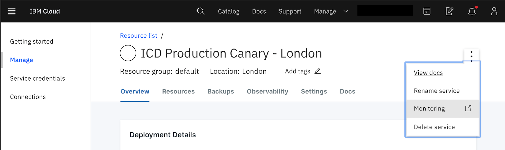
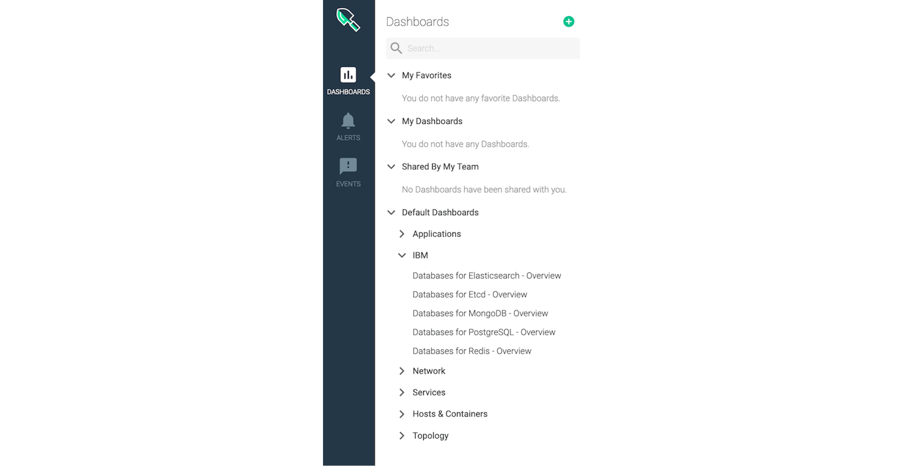

---
copyright:
  years: 2020, 2023
lastupdated: "2023-04-17"

keywords: postgresql, monitoring, metrics, iops, disk usage, memory usage, connection usage, postgresql monitor integration, postgresql disk i/o

subcollection: databases-for-postgresql

---

{{site.data.keyword.attribute-definition-list}}

# Monitoring Integration
{: #monitoring}

Monitoring for {{site.data.keyword.databases-for-postgresql_full}} deployments is provided through integration with the {{site.data.keyword.monitoringfull}} Monitoring service. Your deployments forward selected information so you can monitor deployment health and resource usage. To see your {{site.data.keyword.databases-for-postgresql}} dashboards in {{site.data.keyword.monitoringfull_notm}}, you must [Enable Platform Metrics](/docs/monitoring?topic=monitoring-platform_metrics_enabling) in the same region as your deployment. If you have deployments in more than one region, you must provision {{site.data.keyword.monitoringfull_notm}} and enable platform metrics in each region.

To access {{site.data.keyword.monitoringfull_notm}} from your deployment, use the _Monitoring_ link from the right menu. (If you do not already have a monitoring service in the same region as your deployment it says _Add monitoring_.)

{: caption="Figure 1. The Monitoring link in a deployment" caption-side="top"}

To access your deployment's monitoring dashboard from {{site.data.keyword.monitoringfull_notm}}, it's in the sidebar, under _IBM_.

{: caption="Figure 2. Cloud databases dashboard in monitoring" caption-side="top"}

## Monitoring Availability
{: #monitoring-availability}

{{site.data.keyword.monitoringfull_notm}} monitoring is available for deployments in every region. Deployments in Multi-zone Regions (MZRs) - `eu-gb`, `eu-de`, `us-east`, `us-south`, `jp-tok`, `jp-osa` `au-syd` - have their metrics in the corresponding region.

If you have deployments that are in Single-zone Region (SZR) `che01` then your logs are forwarded to a {{site.data.keyword.monitoringfull_notm}} instance in another region. You need to provision monitoring instances in the region where your metrics are forwarded to. Metrics for deployments in `che01` go to `jp-tok`. 

## Available Metrics
{: #metrics-by-plan}

| Metric Name |
|-----------|
| [Blocks hit rate](#ibm_databases_for_postgresql_blocks_hit_rate) | 
| [Blocks read rate](#ibm_databases_for_postgresql_blocks_read_rate) | 
| [Buffers backend rate](#ibm_databases_for_postgresql_buffers_backend_rate) | 
| [Buffers checkpoint rate](#ibm_databases_for_postgresql_buffers_checkpoint_rate) | 
| [Cache hit ratio](#ibm_databases_for_postgresql_cache_hit_ratio) | 
| [Deadlocks count](#ibm_databases_for_postgresql_deadlocks_count) |
| [Deadlocks rate](#ibm_databases_for_postgresql_deadlocks_rate) | 
| [Disk read latency mean](#ibm_databases_for_postgresql_disk_read_latency_mean) | 
| [Disk write latency mean](#ibm_databases_for_postgresql_disk_write_latency_mean) | 
| [IO usage in percent 5-minute average](#ibm_databases_for_postgresql_disk_io_utilization_percent_average_5m) |
| [IO usage in percent 15-minute average](#ibm_databases_for_postgresql_disk_io_utilization_percent_average_15m) | 
| [IO usage in percent 30-minute average](#ibm_databases_for_postgresql_disk_io_utilization_percent_average_30m) | 
| [IO usage in percent 60-minute average](#ibm_databases_for_postgresql_disk_io_utilization_percent_average_60m) | 
| [IOPS read and write total count for an instance.](#ibm_databases_for_postgresql_disk_iops_read_write_total) | 
| [Max allowed memory for an instance.](#ibm_databases_for_postgresql_memory_limit_bytes) | 
| [Read replica replication lag.](#ibm_databases_for_postgresql_read_replica_replication_lag_bytes) | 
| [Successful archive rate](#ibm_databases_for_postgresql_successful_archive_rate) | 
| [Temporary files size in bytes](#ibm_databases_for_postgresql_temp_bytes_count) |
| [The total number of PostgreSQL connections being used.](#ibm_databases_for_postgresql_total_connections) | 
| [Total disk space for an instance.](#ibm_databases_for_postgresql_disk_total_bytes) | 
| [Transaction commit count](#ibm_databases_for_postgresql_transaction_commit_count) |
| [Transaction commit rate](#ibm_databases_for_postgresql_transaction_commit_rate) | 
| [Transaction rollback count](#ibm_databases_for_postgresql_transaction_rollback_count) |
| [Transaction rollback rate](#ibm_databases_for_postgresql_transaction_rollback_rate) | 
| [Tuples deleted count](#ibm_databases_for_postgresql_tuples_deleted_count) |
| [Tuples deleted rate](#ibm_databases_for_postgresql_tuples_deleted_rate) | 
| [Tuples fetched count](#ibm_databases_for_postgresql_tuples_fetched_count) |
| [Tuples fetched rate](#ibm_databases_for_postgresql_tuples_fetched_rate) | 
| [Tuples inserted count](#ibm_databases_for_postgresql_tuples_inserted_count) |
| [Tuples inserted rate](#ibm_databases_for_postgresql_tuples_inserted_rate) | 
| [Tuples returned rate](#ibm_databases_for_postgresql_tuples_returned_rate) | 
| [Tuples updated count](#ibm_databases_for_postgresql_tuples_updated_count) |
| [Tuples updated rate](#ibm_databases_for_postgresql_tuples_updated_rate) | 
| [Used CPU for an instance.](#ibm_databases_for_postgresql_cpu_used_percent) | 
| [Used disk space for an instance.](#ibm_databases_for_postgresql_disk_used_bytes) | 
| [Used memory for an instance.](#ibm_databases_for_postgresql_memory_used_bytes) | 
| [WAL logs used bytes](#ibm_databases_for_postgresql_wal_used_bytes) |
{: caption="Table 1. Available Metrics" caption-side="top"}

### Blocks hit rate
{: #ibm_databases_for_postgresql_blocks_hit_rate}

Blocks hit rate

| Metadata | Description |
|----------|-------------|
| `Metric Name` | `ibm_databases_for_postgresql_blocks_hit_rate`|
| `Metric Type` | `gauge` |
| `Value Type`  | `rate` |
| `Segment By` | `Service instance` |
{: caption="Table 2: Blocks hit rate metric metadata" caption-side="top"}

### Blocks read rate
{: #ibm_databases_for_postgresql_blocks_read_rate}

Blocks read rate

| Metadata | Description |
|----------|-------------|
| `Metric Name` | `ibm_databases_for_postgresql_blocks_read_rate`|
| `Metric Type` | `gauge` |
| `Value Type`  | `rate` |
| `Segment By` | `Service instance` |
{: caption="Table 3: Blocks read rate metric metadata" caption-side="top"}

### Buffers backend rate
{: #ibm_databases_for_postgresql_buffers_backend_rate}

Buffers backend rate

| Metadata | Description |
|----------|-------------|
| `Metric Name` | `ibm_databases_for_postgresql_buffers_backend_rate`|
| `Metric Type` | `gauge` |
| `Value Type`  | `rate` |
| `Segment By` | `Service instance` |
{: caption="Table 4: Buffers backend rate metric metadata" caption-side="top"}

### Buffers checkpoint rate
{: #ibm_databases_for_postgresql_buffers_checkpoint_rate}

Buffers checkpoint rate

| Metadata | Description |
|----------|-------------|
| `Metric Name` | `ibm_databases_for_postgresql_buffers_checkpoint_rate`|
| `Metric Type` | `gauge` |
| `Value Type`  | `rate` |
| `Segment By` | `Service instance` |
{: caption="Table 5: Buffers checkpoint rate metric metadata" caption-side="top"}

### Cache hit ratio
{: #ibm_databases_for_postgresql_cache_hit_ratio}

Cache hit ratio

| Metadata | Description |
|----------|-------------|
| `Metric Name` | `ibm_databases_for_postgresql_cache_hit_ratio`|
| `Metric Type` | `gauge` |
| `Value Type`  | `percent` |
| `Segment By` | `Service instance` |
{: caption="Table 6: Cache hit ratio metric metadata" caption-side="top"}

### Deadlocks count
{: #ibm_databases_for_postgresql_deadlocks_count}

Deadlocks count

| Metadata | Description |
|----------|-------------|
| `Metric Name` | `ibm_databases_for_postgresql_deadlocks_count`|
| `Metric Type` | `gauge` |
| `Value Type`  | `none` |
| `Segment By` | `Service instance` |
{: caption="Table 7: Deadlocks count metric metadata" caption-side="top"}

### Deadlocks rate
{: #ibm_databases_for_postgresql_deadlocks_rate}

Deadlocks rate

| Metadata | Description |
|----------|-------------|
| `Metric Name` | `ibm_databases_for_postgresql_deadlocks_rate`|
| `Metric Type` | `gauge` |
| `Value Type`  | `rate` |
| `Segment By` | `Service instance` |
{: caption="Table 8: Deadlocks rate metric metadata" caption-side="top"}

### Disk read latency mean
{: #ibm_databases_for_postgresql_disk_read_latency_mean}

Disk read latency mean

| Metadata | Description |
|----------|-------------|
| `Metric Name` | `ibm_databases_for_postgresql_disk_read_latency_mean`|
| `Metric Type` | `gauge` |
| `Value Type`  | `count` |
| `Segment By` | `Service instance` |
{: caption="Table 9: Disk read latency mean metric metadata" caption-side="top"}

### Disk write latency mean
{: #ibm_databases_for_postgresql_disk_write_latency_mean}

Disk write latency mean

| Metadata | Description |
|----------|-------------|
| `Metric Name` | `ibm_databases_for_postgresql_disk_write_latency_mean`|
| `Metric Type` | `gauge` |
| `Value Type`  | `count` |
| `Segment By` | `Service instance` |
{: caption="Table 10: Disk write latency mean metric metadata" caption-side="top"}

### IO usage in percent 5-minute average
{: #ibm_databases_for_postgresql_disk_io_utilization_percent_average_5m}

How much disk I/O has been used over 5 minutes as a percentage of total disk I/O available.

| Metadata | Description |
|----------|-------------|
| `Metric Name` | `ibm_databases_for_postgresql_disk_io_utilization_percent_average_5m`|
| `Metric Type` | `gauge` |
| `Value Type`  | `percent` |
| `Segment By` | `Service instance` |
{: caption="Table 11. IO utilization in percent 5 minute average metric metadata" caption-side="top"}

### IO usage in percent 15-minute average
{: #ibm_databases_for_postgresql_disk_io_utilization_percent_average_15m}

How much disk I/O has been used over 15 minutes as a percentage of total disk I/O available.

| Metadata | Description |
|----------|-------------|
| `Metric Name` | `ibm_databases_for_postgresql_disk_io_utilization_percent_average_15m`|
| `Metric Type` | `gauge` |
| `Value Type`  | `percent` |
| `Segment By` | `Service instance` |
{: caption="Table 12. IO utilization in percent 15 minute average metric metadata" caption-side="top"}

### IO usage in percent 30-minute average
{: #ibm_databases_for_postgresql_disk_io_utilization_percent_average_30m}

How much disk I/O has been used over 30 minutes as a percentage of total disk I/O available.

| Metadata | Description |
|----------|-------------|
| `Metric Name` | `ibm_databases_for_postgresql_disk_io_utilization_percent_average_30m`|
| `Metric Type` | `gauge` |
| `Value Type`  | `percent` |
| `Segment By` | `Service instance` |
{: caption="Table 13. IO utilization in percent 30 minute average metric metadata" caption-side="top"}

### IO usage in percent 60-minute average
{: #ibm_databases_for_postgresql_disk_io_utilization_percent_average_60m}

How much disk I/O has been used over 60 minutes as a percentage of total disk I/O available.

| Metadata | Description |
|----------|-------------|
| `Metric Name` | `ibm_databases_for_postgresql_disk_io_utilization_percent_average_60m`|
| `Metric Type` | `gauge` |
| `Value Type`  | `percent` |
| `Segment By` | `Service instance` |
{: caption="Table 14. IO utilization in percent 60 minute average metric metadata" caption-side="top"}

### IOPS read and write total count for an instance
{: #ibm_databases_for_postgresql_disk_iops_read_write_total}

How many input/output operations per second your deployment is performing.

| Metadata | Description |
|----------|-------------|
| `Metric Name` | `ibm_databases_for_postgresql_disk_iops_read_write_total`|
| `Metric Type` | `gauge` |
| `Value Type`  | `count` |
| `Segment By` | `Service instance` |
{: caption="Table 15. IOPS read & write total count for an instance metric metadata" caption-side="top"}

### Max allowed memory for an instance
{: #ibm_databases_for_postgresql_memory_limit_bytes}

The maximum amount of memory available to your deployment.

| Metadata | Description |
|----------|-------------|
| `Metric Name` | `ibm_databases_for_postgresql_memory_limit_bytes`|
| `Metric Type` | `gauge` |
| `Value Type`  | `byte` |
| `Segment By` | `Service instance` |
{: caption="Table 16. Max allowed memory for an instance metric metadata" caption-side="top"}

### Read replica replication lag
{: #ibm_databases_for_postgresql_read_replica_replication_lag_bytes}

How far behind a PostgreSQL read-only replica is, in bytes.

| Metadata | Description |
|----------|-------------|
| `Metric Name` | `ibm_databases_for_postgresql_read_replica_replication_lag_bytes`|
| `Metric Type` | `gauge` |
| `Value Type`  | `count` |
| `Segment By` | `Service instance` |
{: caption="Table 17. Read replica replication lag metric metadata" caption-side="top"}

### Successful archive rate
{: #ibm_databases_for_postgresql_successful_archive_rate}

Successful archive rate

| Metadata | Description |
|----------|-------------|
| `Metric Name` | `ibm_databases_for_postgresql_successful_archive_rate`|
| `Metric Type` | `gauge` |
| `Value Type`  | `rate` |
| `Segment By` | `Service instance` |
{: caption="Table 18: Successful archive rate metric metadata" caption-side="top"}

### Temporary files size in bytes
{: #ibm_databases_for_postgresql_temp_bytes_count}

Temporary files size in bytes

| Metadata | Description |
|----------|-------------|
| `Metric Name` | `ibm_databases_for_postgresql_temp_bytes_count`|
| `Metric Type` | `gauge` |
| `Value Type`  | `none` |
| `Segment By` | `Service instance` |
{: caption="Table 19: Temporary files size in bytes metric metadata" caption-side="top"}

### The total number of PostgreSQL connections being used
{: #ibm_databases_for_postgresql_total_connections}

The total number of PostgreSQL connections being used.

| Metadata | Description |
|----------|-------------|
| `Metric Name` | `ibm_databases_for_postgresql_total_connections`|
| `Metric Type` | `gauge` |
| `Value Type`  | `count` |
| `Segment By` | `Service instance` |
{: caption="Table 20. The total number of PostgreSQL connections being used metric metadata" caption-side="top"}

### Total disk space for an instance
{: #ibm_databases_for_postgresql_disk_total_bytes}

Represents the total amount of disk available to your deployment.

| Metadata | Description |
|----------|-------------|
| `Metric Name` | `ibm_databases_for_postgresql_disk_total_bytes`|
| `Metric Type` | `gauge` |
| `Value Type`  | `byte` |
| `Segment By` | `Service instance` |
{: caption="Table 21. Total disk space for an instance metric metadata" caption-side="top"}

### Transaction commit count
{: #ibm_databases_for_postgresql_transaction_commit_count}

Transaction commit count

| Metadata | Description |
|----------|-------------|
| `Metric Name` | `ibm_databases_for_postgresql_transaction_commit_count`|
| `Metric Type` | `gauge` |
| `Value Type`  | `none` |
| `Segment By` | `Service instance` |
{: caption="Table 22: Transaction commit count metric metadata" caption-side="top"}

### Transaction commit rate
{: #ibm_databases_for_postgresql_transaction_commit_rate}

Transaction commit rate

| Metadata | Description |
|----------|-------------|
| `Metric Name` | `ibm_databases_for_postgresql_transaction_commit_rate`|
| `Metric Type` | `gauge` |
| `Value Type`  | `rate` |
| `Segment By` | `Service instance` |
{: caption="Table 23: Transaction commit rate metric metadata" caption-side="top"}

### Transaction rollback count
{: #ibm_databases_for_postgresql_transaction_rollback_count}

Transaction rollback count

| Metadata | Description |
|----------|-------------|
| `Metric Name` | `ibm_databases_for_postgresql_transaction_rollback_count`|
| `Metric Type` | `gauge` |
| `Value Type`  | `none` |
| `Segment By` | `Service instance` |
{: caption="Table 24: Transaction rollback count metric metadata" caption-side="top"}

### Transaction rollback rate
{: #ibm_databases_for_postgresql_transaction_rollback_rate}

Transaction rollback rate

| Metadata | Description |
|----------|-------------|
| `Metric Name` | `ibm_databases_for_postgresql_transaction_rollback_rate`|
| `Metric Type` | `gauge` |
| `Value Type`  | `rate` |
| `Segment By` | `Service instance` |
{: caption="Table 25: Transaction rollback rate metric metadata" caption-side="top"}

### Tuples deleted count
{: #ibm_databases_for_postgresql_tuples_deleted_count}

Tuples deleted count

| Metadata | Description |
|----------|-------------|
| `Metric Name` | `ibm_databases_for_postgresql_tuples_deleted_count`|
| `Metric Type` | `gauge` |
| `Value Type`  | `none` |
| `Segment By` | `Service instance` |
{: caption="Table 26: Tuples deleted count metric metadata" caption-side="top"}

### Tuples deleted rate
{: #ibm_databases_for_postgresql_tuples_deleted_rate}

Tuples deleted rate

| Metadata | Description |
|----------|-------------|
| `Metric Name` | `ibm_databases_for_postgresql_tuples_deleted_rate`|
| `Metric Type` | `gauge` |
| `Value Type`  | `rate` |
| `Segment By` | `Service instance` |
{: caption="Table 27: Tuples deleted rate metric metadata" caption-side="top"}

### Tuples fetched count
{: #ibm_databases_for_postgresql_tuples_fetched_count}

Tuples fetched count

| Metadata | Description |
|----------|-------------|
| `Metric Name` | `ibm_databases_for_postgresql_tuples_fetched_count`|
| `Metric Type` | `gauge` |
| `Value Type`  | `none` |
| `Segment By` | `Service instance` |
{: caption="Table 28: Tuples fetched count metric metadata" caption-side="top"}

### Tuples fetched rate
{: #ibm_databases_for_postgresql_tuples_fetched_rate}

Tuples fetched rate

| Metadata | Description |
|----------|-------------|
| `Metric Name` | `ibm_databases_for_postgresql_tuples_fetched_rate`|
| `Metric Type` | `gauge` |
| `Value Type`  | `rate` |
| `Segment By` | `Service instance` |
{: caption="Table 29: Tuples fetched rate metric metadata" caption-side="top"}

### Tuples inserted count
{: #ibm_databases_for_postgresql_tuples_inserted_count}

Tuples inserted count

| Metadata | Description |
|----------|-------------|
| `Metric Name` | `ibm_databases_for_postgresql_tuples_inserted_count`|
| `Metric Type` | `gauge` |
| `Value Type`  | `none` |
| `Segment By` | `Service instance` |
{: caption="Table 30: Tuples inserted count metric metadata" caption-side="top"}

### Tuples inserted rate
{: #ibm_databases_for_postgresql_tuples_inserted_rate}

Tuples inserted rate

| Metadata | Description |
|----------|-------------|
| `Metric Name` | `ibm_databases_for_postgresql_tuples_inserted_rate`|
| `Metric Type` | `gauge` |
| `Value Type`  | `rate` |
| `Segment By` | `Service instance` |
{: caption="Table 31: Tuples inserted rate metric metadata" caption-side="top"}

### Tuples returned rate
{: #ibm_databases_for_postgresql_tuples_returned_rate}

Tuples returned rate

| Metadata | Description |
|----------|-------------|
| `Metric Name` | `ibm_databases_for_postgresql_tuples_returned_rate`|
| `Metric Type` | `gauge` |
| `Value Type`  | `rate` |
| `Segment By` | `Service instance` |
{: caption="Table 32: Tuples returned rate metric metadata" caption-side="top"}

### Tuples updated count
{: #ibm_databases_for_postgresql_tuples_updated_count}

Tuples updated count

| Metadata | Description |
|----------|-------------|
| `Metric Name` | `ibm_databases_for_postgresql_tuples_updated_count`|
| `Metric Type` | `gauge` |
| `Value Type`  | `none` |
| `Segment By` | `Service instance` |
{: caption="Table 33: Tuples updated count metric metadata" caption-side="top"}

### Tuples updated rate
{: #ibm_databases_for_postgresql_tuples_updated_rate}

Tuples updated rate

| Metadata | Description |
|----------|-------------|
| `Metric Name` | `ibm_databases_for_postgresql_tuples_updated_rate`|
| `Metric Type` | `gauge` |
| `Value Type`  | `rate` |
| `Segment By` | `Service instance` |
{: caption="Table 34: Tuples updated rate metric metadata" caption-side="top"}

### Used CPU for an instance
{: #ibm_databases_for_postgresql_cpu_used_percent}

How much CPU is used as a percentage of total CPU available. Only for deployments that have dedicated CPU.

| Metadata | Description |
|----------|-------------|
| `Metric Name` | `ibm_databases_for_postgresql_cpu_used_percent`|
| `Metric Type` | `gauge` |
| `Value Type`  | `percent` |
| `Segment By` | `Service instance` |
{: caption="Table 35. Used CPU for an instance metric metadata" caption-side="top"}

### Used disk space for an instance
{: #ibm_databases_for_postgresql_disk_used_bytes}

How much disk your deployment is using.

| Metadata | Description |
|----------|-------------|
| `Metric Name` | `ibm_databases_for_postgresql_disk_used_bytes`|
| `Metric Type` | `gauge` |
| `Value Type`  | `byte` |
| `Segment By` | `Service instance` |
{: caption="Table 36. Used disk space for an instance metric metadata" caption-side="top"}

### Used memory for an instance
{: #ibm_databases_for_postgresql_memory_used_bytes}

How much memory your deployment is using.

| Metadata | Description |
|----------|-------------|
| `Metric Name` | `ibm_databases_for_postgresql_memory_used_bytes`|
| `Metric Type` | `gauge` |
| `Value Type`  | `byte` |
| `Segment By` | `Service instance` |
{: caption="Table 37. Used memory for an instance metric metadata" caption-side="top"}

### WAL logs used bytes
{: #ibm_databases_for_postgresql_wal_used_bytes}

How much wal log file uses, in bytes

| Metadata | Description |
|----------|-------------|
| `Metric Name` | `ibm_databases_for_postgresql_wal_used_bytes`|
| `Metric Type` | `gauge` |
| `Value Type`  | `count` |
| `Segment By` | `Service instance` |
{: caption="Table 38: WAL logs used bytes metric metadata" caption-side="top"}

## Attributes for Segmentation
{: #attributes}

### Global Attributes
{: #global-attributes}

The following attributes are available for segmenting all of the metrics listed.

| Attribute | Attribute Name | Attribute Description |
|-----------|----------------|-----------------------|
| `Cloud Type` | `ibm_ctype` | The cloud type is a value of public, dedicated, or local. |
| `Location` | `ibm_location` | The location of the monitored resource - this can be a region, data center, or global. |
| `Resource` | `ibm_resource` | The resource being measured by the service - typically an identifying name or GUID. |
| `Resource Type` | `ibm_resource_type` | The type of the resource being measured by the service. |
| `Scope` | `ibm_scope` | The scope is the account, organization, or space GUID associated with this metric. |
{: caption="Table 39. Global Attributes Metadata" caption-side="top"}

### More Attributes
{: #additional-attributes}

The following attributes are available for segmenting one or more attributes as described in the reference above. See the individual metrics for segmentation options.

| Attribute | Attribute Name | Attribute Description |
|-----------|----------------|-----------------------|
| `Service instance` | `ibm_service_instance` | The service instance segment identifies the instance that the metric is associated with. |
| `Service instance name` | `ibm_service_instance_name` | The service instance name provides the user-provided name of the service instance, which isn't necessarily a unique value depending on the name that is provided by the user. |
| `Resource group` | `ibm_resource_group_name` | The resource group where the service instance was created. |
{: caption="Table 40. Additional Attributes Metadata" caption-side="top"}
